# MOFU Pet E-commerce Frontend

> [!IMPORTANT]
>
> - 本專案商品資訊係由公開 API 取得並進行部分修改，僅作為功能展示用途，無營利或商用目的

## 專案摘要

隨著飼主對寵物健康與生活品質的重視程度提升，寵物產品逐漸朝向專業化與精緻化發展，針對寵物的年齡、體型、品種、健康狀況、生活習慣與使用限制，開發不同成分、功能與規格的商品。然而，現有電商平台大多僅以商品分類及關鍵字精確搜尋作為主要篩選方式，消費者仍須從頁面上的大量文字自行判讀諸如成分說明、適用條件及使用限制等資訊，才能確認商品是否符合寵物的實際需求。

本專案以建立寵物產品智慧導購平台為目標，透過商品資訊結構化、寵物資料建檔及對話式需求分析，協助使用者依據寵物的實際條件與使用情境，篩選較適合的商品與規格。

## 技術棧

- Next.js App Router：負責頁面路由、Server Component / Client Component 分工與 API rewrite。
- React：以 component-driven UI 組織商品卡片、快速購物、會員頁與客服聊天。
- TypeScript：定義 API response、domain model 與元件 props，降低前後端資料契約錯位。
- Tailwind CSS：建立 responsive layout、商品列表、會員版型與狀態樣式。
- Radix UI：支援表單、互動元件與一致的 UI 組合。
- Socket.IO：支援客服聊天、客服端狀態與即時訊息同步。
- API integration：透過 `/api` rewrite 串接後端商品、會員、寵物、訂單、聊天與 AI 推薦 API。
  ([ 後端 repo ](https://github.com/sugarban-p/mfee74-final-backend))

## 團隊成員

| 成員          | 職責   | 開發內容                                    | 其他工作                                      |
| :------------ | :----- | :------------------------------------------ | :-------------------------------------------- |
| `eviechen128` | 組長   | 首頁、Footer、活動頁、寵物檔案管理、AI 導購 | 期程規劃、進度追蹤                            |
| `sugarban-p`  | 技術長 | 導覽列、商品列表/詳情、收藏清單、快速購物   | 專案環境建置 & 架構規劃、資料庫整合、Git 整合 |
| `naa023`      | 美術長 | 購物車頁面、結帳頁面、訂單管理              | 網站視覺、LOGO 設計、第三方金流串接           |
| `yixuan-429`  |        | 登入/註冊、會員中心、線上客服               |                                               |

## 專案架構

```text
/
├─ src/                      # 前端主要原始碼
│   ├─ app/                  # App Router routes 與頁面模組
│   │   ├─ auth/             # 登入、註冊、忘記密碼與帳號鎖定頁
│   │   ├─ member/           # 會員中心 layout 與會員功能頁
│   │   │   ├─ dashboard/    # 會員資料總覽、安全設定與主要 dashboard
│   │   │   ├─ orders/       # 會員訂單查詢與訂單明細
│   │   │   ├─ favorites/    # 會員收藏商品列表
│   │   │   ├─ pets/         # 寵物資料管理頁
│   │   │   ├─ coupons/      # 會員優惠券列表
│   │   │   └─ support/      # 會員客服支援入口
│   │   ├─ product/          # 貓狗商品列表、詳情與分類路由
│   │   ├─ cart/             # 購物車頁與商品數量調整流程
│   │   ├─ checkout/         # 結帳頁、付款結果與錯誤狀態頁
│   │   ├─ activity/         # 活動入口頁與促銷內容頁
│   │   └─ support/          # 客服聊天頁與即時支援入口
│   ├─ components/           # Header、Footer、AppShell 等全站共用元件
│   │   ├─ common/           # Header、Footer、AppShell、IdleLogoutGuard 等基礎元件
│   │   ├─ header/           # MegaMenu 與 Header 導覽相關元件
│   │   ├─ product/          # ProductCard、ProductListClient、QuickShoppingSection 等商品共用元件
│   │   ├─ pets/             # 寵物資料卡片、表單、刪除對話框等元件
│   │   ├─ member/           # 會員 dashboard client 與會員頁互動元件
│   │   └─ activity/         # 活動詳情頁共用呈現元件
│   ├─ services/             # API service wrappers 與前端資料整合
│   └─ types/                # API response、domain model TypeScript types
└─ public/                   # Logo、商品圖、活動圖與靜態素材
```

## 頁面功能說明

### 首頁與活動入口

首頁以滿版 hero、活動輪播、貓狗商品入口、AI 導購 CTA 與 FAQ 組成，讓使用者能從品牌頁快速進入商品、活動與會員導購流程。

| PC                                            | mobile                                               |
| :-------------------------------------------- | :--------------------------------------------------- |
| 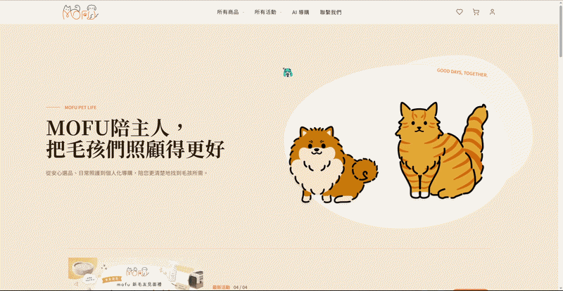 |  |

### 商品列表

商品以卡片形式呈現，可進行收藏及快速購物功能；列表頁提供商品類別、商品標籤及價格範圍等篩選功能，並支援文字模糊搜尋、排序與分頁。

| PC                                                | mobile                                                   |
| :------------------------------------------------ | :------------------------------------------------------- |
| 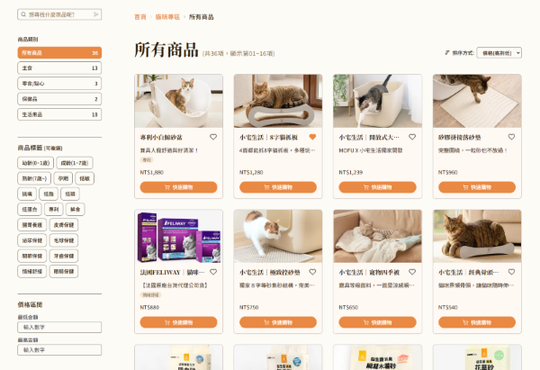 | 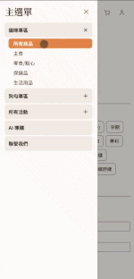 |

### 快速購物

快速購物 modal 可從商品卡片直接選擇規格、調整數量、加入購物車，減少使用者進入詳情頁的步驟。

| PC                                                  | mobile                                                     |
| :-------------------------------------------------- | :--------------------------------------------------------- |
| 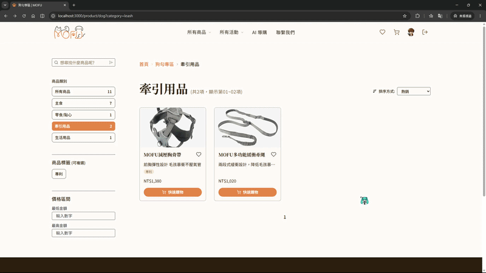 | 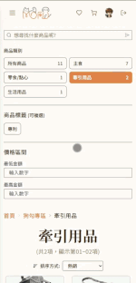 |

### 商品詳情

商品詳情頁整合商品圖片、規格、收藏狀態、加入購物車與推薦商品

| PC                                                  | mobile                                                     |
| :-------------------------------------------------- | :--------------------------------------------------------- |
| 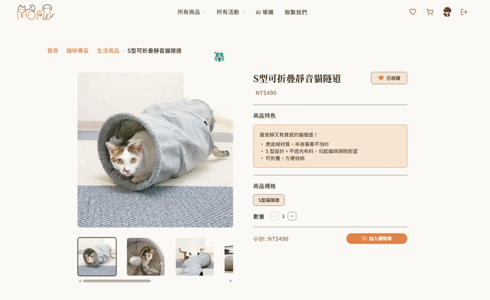 | 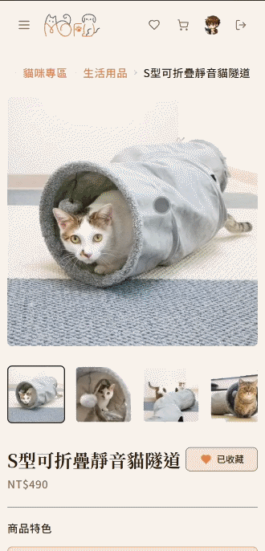 |

### 收藏清單

收藏功能串接會員狀態與 `/api/products/updateFavorite`，並在會員收藏頁呈現已收藏商品。

| PC                                             | mobile                                                |
| :--------------------------------------------- | :---------------------------------------------------- |
| 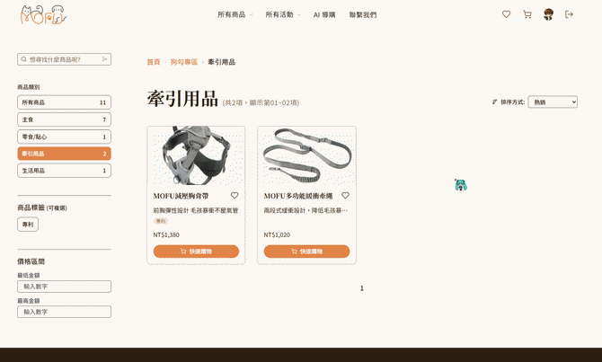 | 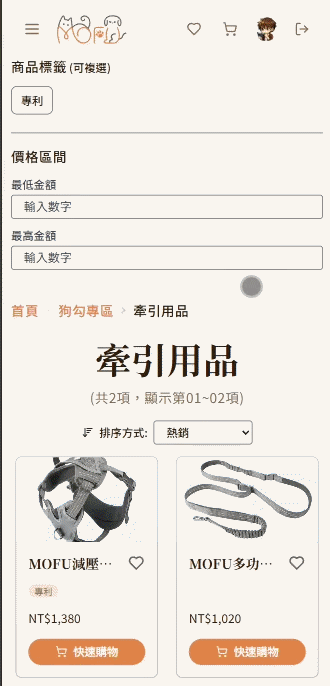 |

### 購物車、結帳與訂單

購物車支援品項數量調整、優惠券選擇與訂單摘要；結帳流程包含訂購內容確認、收件資訊與付款方式；訂單頁提供狀態篩選、訂單詳情、取消與再次購買入口。

| PC                                            | mobile                                               |
| :-------------------------------------------- | :--------------------------------------------------- |
| 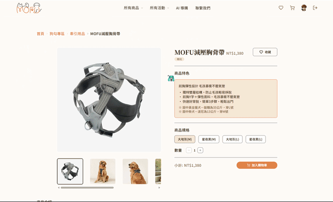 | 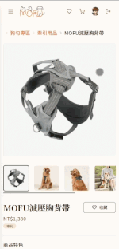 |

| PC                                          | mobile                                             |
| :------------------------------------------ | :------------------------------------------------- |
| 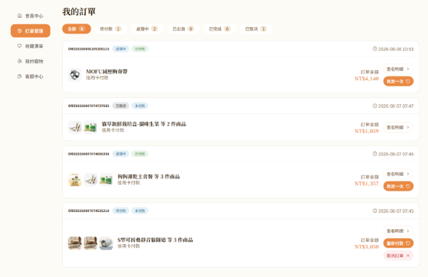 | 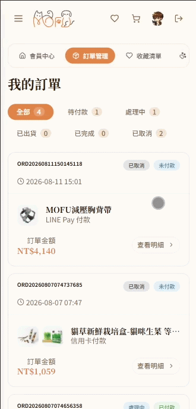 |

### 會員、Auth 與寵物資料

會員中心整合個人資料、帳號安全、訂單、收藏與寵物入口。Protected routes 會在未登入時導回 `/auth/login?next=...`，保留使用者原本要前往的路徑。

| PC                                                    | mobile                                                       |
| :---------------------------------------------------- | :----------------------------------------------------------- |
| 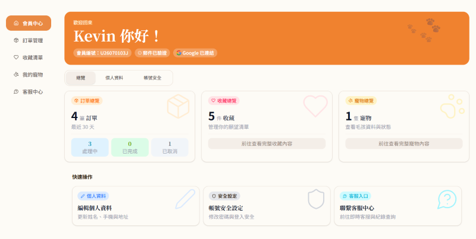 | 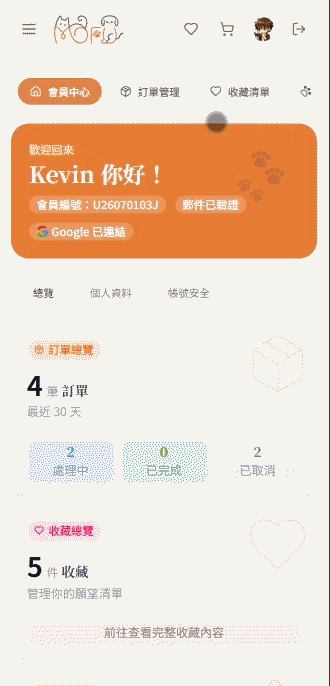 |

### AI 推薦與客服聊天

AI 導購會依寵物資料與需求類型建立推薦情境，並將推薦商品映射回共用 `ProductCard`。客服中心整合 AI 客服、人工客服入口、聊天紀錄與 Socket.IO 即時訊息。

| PC                                                    | mobile                                                       |
| :---------------------------------------------------- | :----------------------------------------------------------- |
| 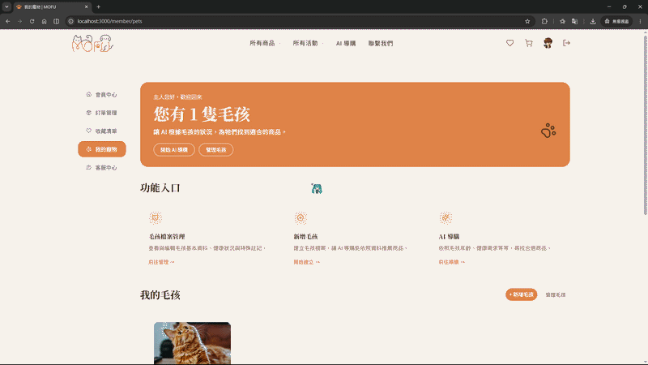 | 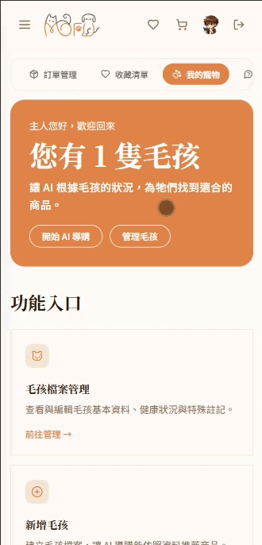 |

| PC                                                | mobile                                                   |
| :------------------------------------------------ | :------------------------------------------------------- |
| 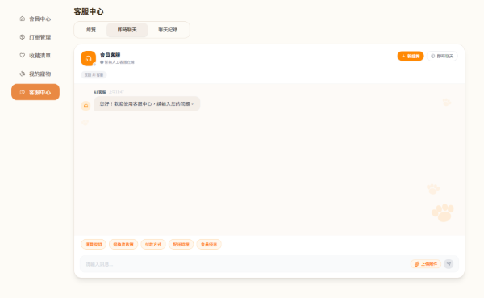 | 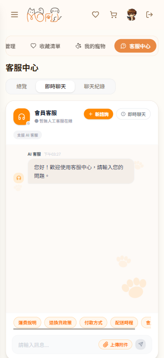 |
